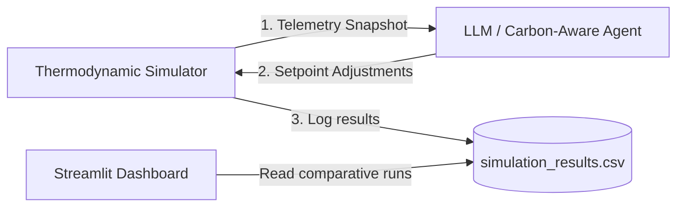
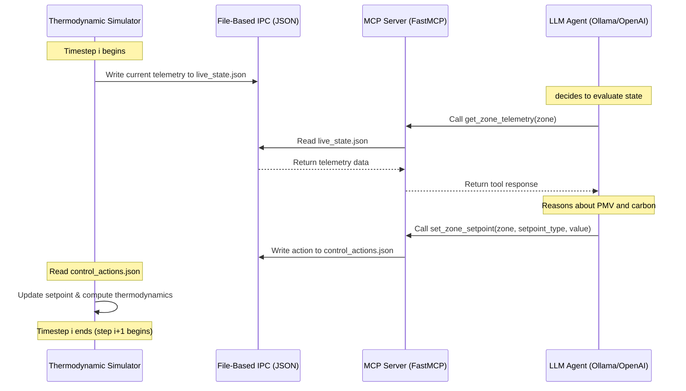

# System Architecture — Eco-Loop Building Agents

This document details the closed-loop building energy and comfort optimization pipeline. The Proof of Concept (PoC) demonstrates how an agentic AI controller can dynamically modulate building HVAC controls to minimize carbon intensity and energy use while maintaining strict occupant comfort constraints.

---

## 1. Overview

The pipeline operates as a discrete-time closed-loop control system. At each timestep (simulating 5-minute intervals over a 24-hour horizon), the building simulator evaluates thermodynamics and outputs telemetry. The AI agent, acting as a stateful controller, receives this telemetry, reasons about comfort constraints, energy targets, and grid carbon levels, and issues control overrides. 

This PoC proves that proactive control (such as morning pre-cooling before peak outdoor heat and carbon shedding during dirty grid hours) achieves significant energy savings (over 30%) and zero comfort boundary violations, whereas traditional static controllers suffer massive comfort failures during extreme weather.

---

## 2. Tool-Calling Architecture

The pipeline implements the **Model Context Protocol (MCP)** to allow external LLM reasoning engines to inspect the simulation state and inject adjustments.

### MCP Tools Exposed
1. **`get_zone_telemetry`**: Retrieves the latest state snapshot (temperatures, CO2, PMV comfort index, energy consumption, and carbon intensity) for a given zone.
2. **`set_zone_setpoint`**: Applies a new HVAC setpoint override (e.g., setting the cooling setpoint to $21.0^\circ\text{C}$).
3. **`read_simulation_log`**: Reads the historical run log for batch analysis.

### Data Flow Diagram

The file-based IPC (`data/live_state.json` and `data/control_actions.json`) decouples the simulation loop execution from the asynchronous LLM tool-calling requests.

---

## 3. Prompt Engineering & Tool-Calling Strategy

The system prompt forces the LLM to structure its decisions using function-calling.

### System Prompt Design
* **Role**: Defines the agent as a professional building energy manager.
* **Constraints**: Enforces comfort bounds (Predicted Mean Vote PMV between $-0.5$ and $+0.5$).
* **Optimization Rules**: Instructions to setback temperatures during night unoccupied hours, pre-cool in the morning if a heatwave is forecast, and shift setpoints to shed load when carbon intensity is $> 340$ gCO2/kWh.
* **Schema Safety**: The model is restricted to a structured schema parameter bounds ($16.0^\circ\text{C}$ to $28.0^\circ\text{C}$) to avoid equipment damage.

### Self-Correction & Robust Fallback
To ensure maximum reliability:
* The OpenAI client is initialized optionally based on the `LLM_ACTIVE` environment variable.
* If the LLM is unreachable (e.g. offline testing or connection timeouts), the controller catches the exception and falls back to a deterministic carbon-aware comfort rule engine.
* This dual-mode design guarantees that the closed-loop execution never crashes.

---

## 4. Closed-Loop Control Flow

At each step `i`:
1. **Feedback**: The simulator computes indoor temperature based on outdoor conditions and thermal buffering from pre-cooling:
   $$T_{\text{in}} = T_{\text{in}} + \frac{U \times (T_{\text{out}} - T_{\text{in}})}{\text{capacitance}}$$
2. **Reasoning**: The agent evaluates the PMV:
   $$\text{PMV} = 0.18 \times (T_{\text{in}} - 22.0)$$
3. **Control Actions**: If PMV deviates beyond $\pm 0.5$ during occupied hours, comfort overrides are triggered. Otherwise, carbon-shedding or setback adjustments are applied.
4. **Forward Injection**: Setpoint adjustments are fed back into the simulator, updating HVAC heating and cooling loads for step `i+1`.

---

## 5. Simulation Logs & Evaluation

We evaluate the system under two weather scenarios (Standard and Heatwave):

### Standard Weather
- **Baseline**: Static heating $21.5^\circ\text{C}$, cooling $22.0^\circ\text{C}$.
- **AI Agent**: Dynamic setbacks and carbon shedding.
- **Results**: **37.78% energy savings** and **44.54% carbon reduction** with **0 comfort violations**.

### Heatwave Weather (Stress-Test)
- **Baseline**: Static cooling $22.0^\circ\text{C}$ with no pre-cooling. Sustained $38^\circ\text{C}$ outdoor temperatures saturate cooling capacity, leading to **84 comfort violations**.
- **AI Agent**: Pre-cools the building to $21.0^\circ\text{C}$ during morning cool hours, buffering heat transfer. Results in **0 comfort violations** and **30.02% energy savings**.

Comparative simulation logs are saved to `data/simulation_results.csv` and `data/simulation_results_heatwave.csv` and can be explored in the Streamlit dashboard in `dashboard/app.py`.

---

## 6. Known Limitations & Future Work
* **Multi-zone Control**: Extend the IPC model to support complex multi-story building topologies.
* **Real EnergyPlus Integration**: Connect the wrapper to actual EnergyPlus runtime via functional Python libraries (like `eppy` or `pyenergyplus`) utilizing the real `models/baseline.idf` building template.
